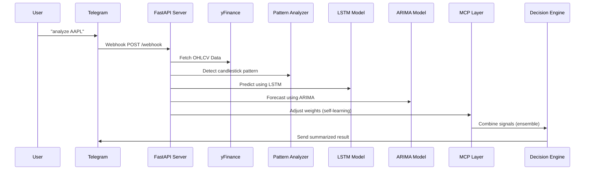

# 🧠 MCP_Financial_Agent

### A Multi-Agent Financial AI System with Model Context Protocol (MCP), Numerical Prediction, and Sentiment Fusion

---

## 📘 Overview

**MCP_Financial_Agent** is an intelligent, **multi-agent financial analysis system** that blends **numerical forecasting**, **sentiment reasoning**, and **contextual memory** using the **Model Context Protocol (MCP)** and **LangGraph**.

It simulates the behavior of a **hedge-fund-grade AI analyst** — collecting real-time data, performing technical and quantitative analysis, predicting market movements, and providing **BUY / SELL / HOLD recommendations** with confidence levels.

---

## 🚀 Key Features

| Capability                              | Description                                                                             |
| --------------------------------------- | --------------------------------------------------------------------------------------- |
| 🧮 **Numerical Forecasting**            | Predicts short-term price trends using ARIMA, Prophet, and LSTM models.                 |
| 🗞️ **Sentiment Analysis**              | Analyzes financial news and social signals for bullish/bearish tone.                    |
| 📊 **Technical Indicators**             | Computes RSI, EMA, MACD, and Bollinger Bands to detect trend strength.                  |
| 🧠 **MCP Context Memory**               | Remembers model performance, adjusts weights dynamically, and stores market narratives. |
| ⚖️ **Hybrid Decisioning (LLM + Quant)** | Combines reasoning from language models with mathematical predictions.                  |
| 🔁 **Adaptive Learning**                | Improves accuracy over time by tracking and rewarding best-performing models.           |
| ⏱️ **Multi-Timeframe Analysis**         | Analyzes 1-minute, 15-minute, and 1-hour candlestick data for precision.                |
| 💬 **Natural Language Reports**         | Generates executive-level memos summarizing findings and recommendations.               |

---

## 🧩 System Architecture

### 🔹 Workflow Diagram

```
[Data Collector Agent] 
     ↓
[Quant & Numerical Agents] → ARIMA / LSTM Forecasts
     ↓
[Sentiment Agent] → News & Tone Analysis
     ↓
[Quant Analysis Agent] → RSI / EMA / MACD
     ↓
[Ensemble Agent + MCP Manager] → Combine & Learn
     ↓
[Report Agent] → Final Memo & Recommendation
```

---

## 🧬 Workflow Diagram




## 💬 Example Interaction

**User:**
`analyze TSLA`

**Bot Reply:**

```
📊 TSLA Market Summary:
🕯️ Pattern: Bullish Engulfing
💬 Sentiment: Positive (+0.27)
🔮 Forecasts:
   • ARIMA: ↑ +0.41%
   • LSTM: ↑ +0.32%
✅ Recommendation: BUY (Confidence: 84%)
```

---

## 🧠 Candlestick Patterns Detected

| Pattern                  | Description               |
| ------------------------ | ------------------------- |
| 🟩 **Bullish Engulfing** | Indicates upward reversal |
| 🟥 **Bearish Engulfing** | Signals downward trend    |
| ⚫ **Doji**               | Market indecision         |
| 🔨 **Hammer**            | Bullish reversal pattern  |
| 🌠 **Shooting Star**     | Bearish reversal signal   |
| 🌅 **Morning Star**      | Strong bullish reversal   |

---

## 🧮 LSTM + ARIMA Fusion

The system combines **ARIMA (statistical)** and **LSTM (neural)** outputs using a **weighted ensemble**.
The weights are **adaptively tuned** by the MCP layer based on:

* Prediction accuracy
* Timeframe reliability
* Recent volatility

```python
final_prediction = w1 * lstm_forecast + w2 * arima_forecast
```


### 🔹 Data Flow Summary

```
Trigger → Data Fetch → Numerical Forecast → Sentiment → Ensemble Fusion → Context Memory (MCP) → Final Report
```

---

## 🧠 Model Context Protocol (MCP)

The **Model Context Protocol** enables adaptive reasoning across models.
MCP acts as the *intelligent glue* between agents — maintaining historical accuracy, adjusting ensemble weights, and preserving contextual memory across sessions.

**MCP Responsibilities:**

* Track model performance (ARIMA, LSTM, Prophet)
* Update ensemble weights dynamically
* Store vector embeddings of market narratives
* Enable contextual recall for future decisions

---

## 📁 Repository Structure

```
MCP_Financial_Agent/
│
├── main.py                    # Orchestrator entry point
│
├── config/
│   ├── settings.yaml           # Model and API configuration
│   └── secrets.env             # API keys and secrets
│
├── core/
│   ├── state.py                # Shared AgentState object
│   ├── orchestrator.py         # LangGraph orchestration flow
│   └── mcp_manager.py          # MCP memory, performance tracking
│
├── agents/
│   ├── data_collector_agent.py # Fetches OHLCV + news
│   ├── quant_analysis_agent.py # Computes indicators (RSI, EMA, etc.)
│   ├── sentiment_agent.py      # Analyzes sentiment
│   ├── numerical_agent.py      # Runs ARIMA / LSTM / Prophet
│   ├── ensemble_agent.py       # Fuses signals + decisions
│   └── report_agent.py         # Generates Markdown investment memo
│
├── models/
│   ├── arima_model.py
│   ├── lstm_model.py
│   └── prophet_model.py
│
├── tools/
│   ├── fetch_news.py
│   ├── fetch_ohlcv.py
│   ├── indicators.py
│   └── utils.py
│
└── memory/
    ├── vector_store.py         # FAISS or Chroma vector memory
    └── model_performance_db.py # SQLite/Redis performance store
```

---

## ⚙️ Installation

### 1️⃣ Clone the Repository

```bash
git clone https://github.com/yourusername/MCP_Financial_Agent.git
cd MCP_Financial_Agent
```

### 2️⃣ Create and Activate a Virtual Environment

```bash
python -m venv venv
source venv/bin/activate    # macOS/Linux
venv\Scripts\activate       # Windows
```

### 3️⃣ Install Dependencies

```bash
pip install -r requirements.txt
```

---

## 🔑 Configuration

Create a `.env` file under `config/`:

```bash
ALPHA_VANTAGE_API_KEY=your_api_key
NEWS_API_KEY=your_api_key
OPENAI_API_KEY=your_api_key
```

Edit `config/settings.yaml` to adjust:

```yaml
model:
  reasoning: "gpt-5"
  forecasting: ["arima", "lstm", "prophet"]
  ensemble_weights: [0.4, 0.3, 0.3]

mcp:
  memory_store: "vector"
  db_type: "sqlite"
```

---

## 🚀 Run the Agent

Example command:

```bash
python main.py --ticker "TSLA"
```

Expected output:

```
[Ticker: TSLA]
Prediction: +1.8% in next 1h
Recommendation: BUY (Confidence 0.82)
Rationale: Positive news sentiment and strong momentum indicators.
```

---

## 📊 Example JSON Output

```json
{
  "ticker": "AAPL",
  "forecast": {
    "arima_next_15m": "+1.2%",
    "lstm_next_1m": "+0.4%",
    "prophet_next_1h": "+2.1%"
  },
  "sentiment": {
    "news_sentiment": 0.65,
    "market_sentiment": 0.58
  },
  "technical": {
    "RSI": 48,
    "MACD": "bullish crossover"
  },
  "ensemble_decision": {
    "final_score": 0.74,
    "recommendation": "BUY",
    "confidence": 0.83
  },
  "rationale": "Positive sentiment and quantitative forecast suggest short-term upside."
}
```

---

## 🧩 Ensemble Logic (Simplified)

```python
score = (
    0.4 * forecast_confidence +
    0.3 * sentiment_score +
    0.3 * indicator_signal
)

if score > 0.6:
    decision = "BUY"
elif score < 0.4:
    decision = "SELL"
else:
    decision = "HOLD"
```

---

## 🧬 Adaptive Learning with MCP

MCP learns continuously:

1. Logs every forecast and actual price movement
2. Updates model accuracy metrics
3. Reweights models automatically
4. Preserves contextual embeddings for trend continuity

Example:

```
[LSTM Accuracy ↑] → Weight adjusted to 0.5
[ARIMA Drift Detected] → Reduced to 0.2
```

---

## 📈 Visualization (Optional)

Use `matplotlib` or `plotly` in `report_agent.py` to generate:

* Predicted vs Actual price charts
* Sentiment trendlines
* Confidence vs Accuracy curves

---

## 🧠 Tech Stack

| Layer             | Technology                         |
| ----------------- | ---------------------------------- |
| Workflow          | **LangGraph**                      |
| Contextual Memory | **Model Context Protocol (MCP)**   |
| LLM               | **GPT-5 / Gemini 1.5 Pro**         |
| Numerical Models  | **ARIMA, Prophet, LSTM (PyTorch)** |
| Data Sources      | **yFinance, NewsAPI, SEC EDGAR**   |
| Vector Store      | **Chroma / FAISS**                 |
| Database          | **SQLite / Redis**                 |

---

## 🤖 Future Enhancements

* Integrate **Reinforcement Learning (RLHF)** for decision feedback loops
* Add **Transformer-based forecasting** (Temporal Fusion Transformer)
* Implement **Paper Trading** with Alpaca or Binance API
* Deploy via **CrewAI Runtime** or **LangGraph Cloud**

---

## 🧾 License

MIT License © 2025 — You are free to modify and distribute with attribution.

